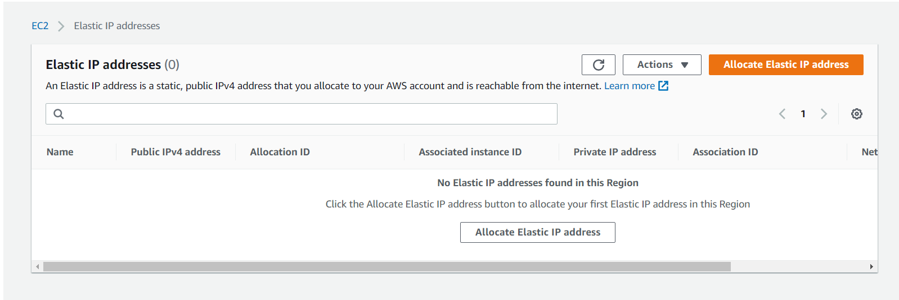
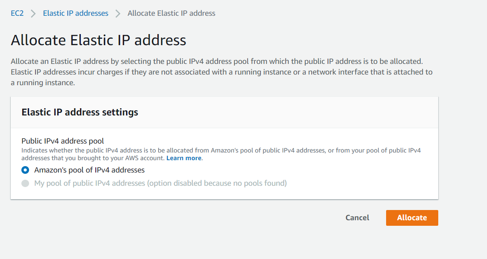
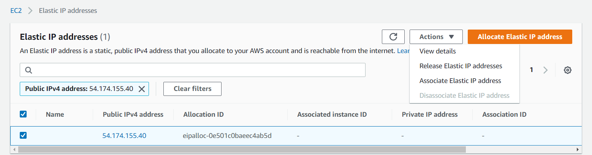
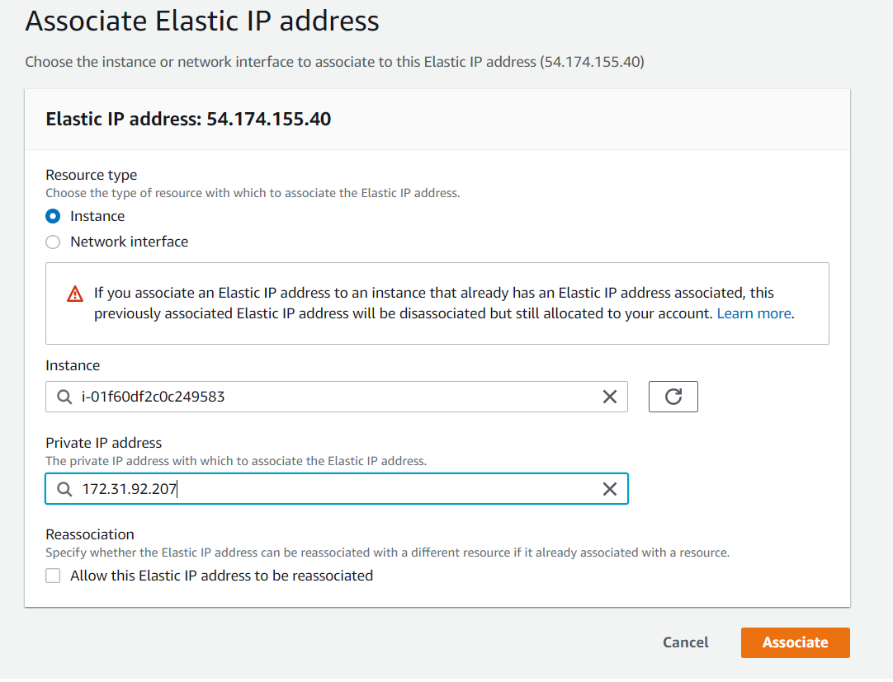
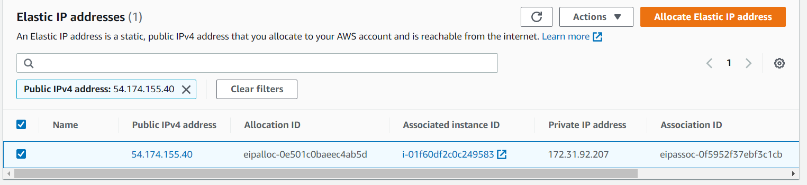

# 1. direccionamiento IP Elastica en AWS

### 1.1 Crear IP Elastica

Tendremos que ir al apartado Elastic IP addresses, y darle a "Allocate Elastic IP address".

Aqui le damos a "Allocate".

ya tenemos una IP Elastica, ahora debemos asociar a nuestro maquina virtual, para ello le damos a Action/Associate Elastic IP address.

Aqui seleccionamos la maquina virtual y la IP privada con el que esta associada la IP estatica.

Ya tenemos configurado la IP Elastica y asociada a la maquina virtual.

