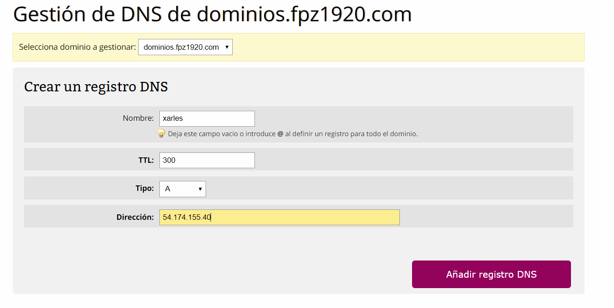

# 1. Gestión de DNS

### 1.1 Añadir un subdominio

Vamos a Registros DNS.

### 1.2 tipos de DNS

 Tipo A: es para IP-s(0.0.0.0 por ejemplo). 
Tipo CNAME es para direcciones URL(www.google.es por ejemplo).
Tipo AAAA: es para IP-s IPv6.
Tipo TXT: son un tipo de registros de sistema de nombres de dominio (DNS) que contienen información de texto de fuentes externas a tu dominio y que puedes añadir a su configuración.

Nosotros pondremos el nombre del subdominio(en mi caso "xarles") del tipo A y ponemos la IP Estatica que tenemos en AWS IP Estatica.

Ya tienes todo configurado. :smile: