# 1. Crear un servidor para dar respuesta las necesidades de la aplicación a desarrollar.

### 1.1 conectarse al servidor

para conectarte al servidor, nos conectaremos via ssh y cogemos la ip del servidor.

Ejemplo:
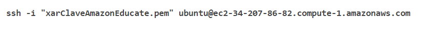

### 1.2 Instalar apache2
para instalar el apache tendremos que meter este comando:

### 1.3 Instalar MySQL
Para instalar el mysql server procederemos a meter este comando:

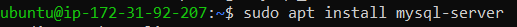
 
 despues de haber instalado el mysql procederemos a configurarlo,
 meter este comando para configurarlo:

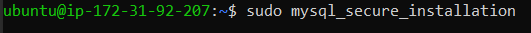

todo lo que te ponga aqui, dale a "Y"  o si usted desea cambia como tu quieras

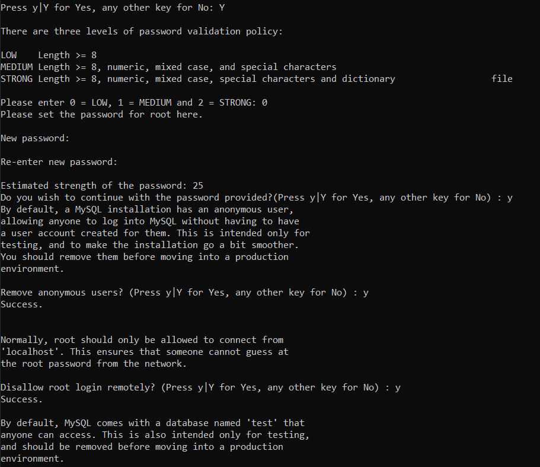
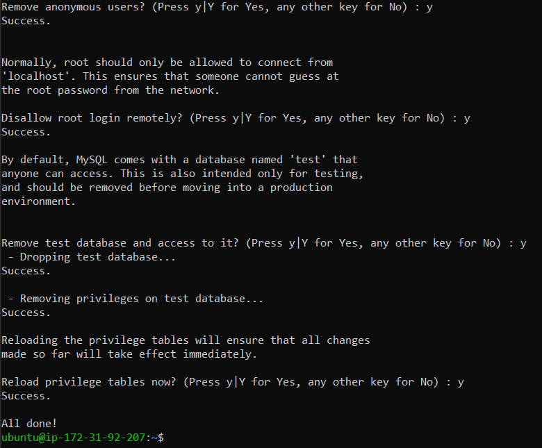

Metemos este comando para configurar el phpmyadmin:

Seleccionamos el apache2 que instalamos anteriormente y le damos a Ok.

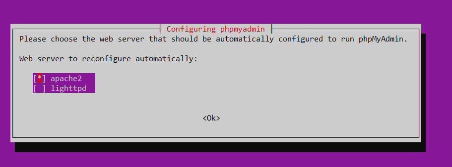

Le damos a Yes
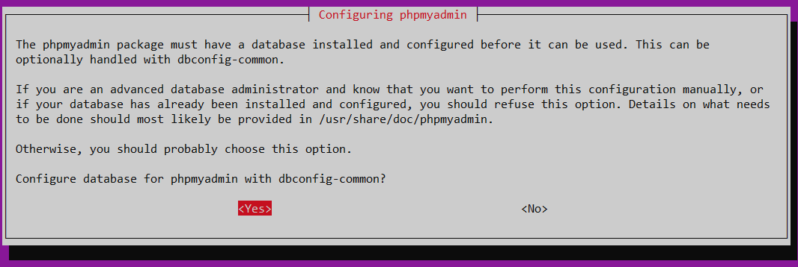

pon una contraseña:
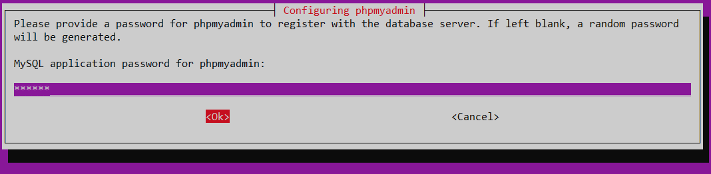
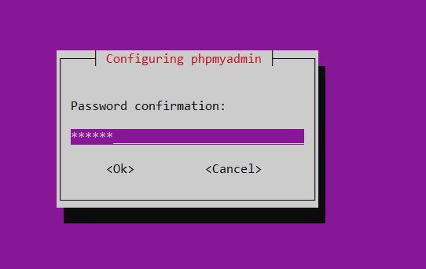

le damos a "retry" y luego a "Yes".
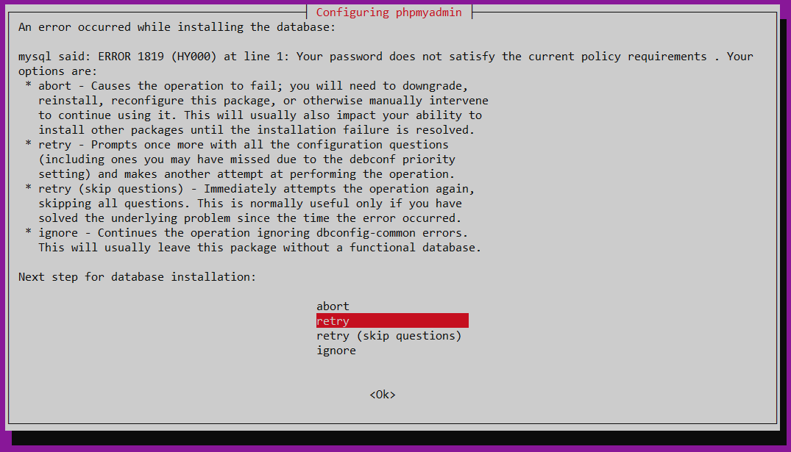
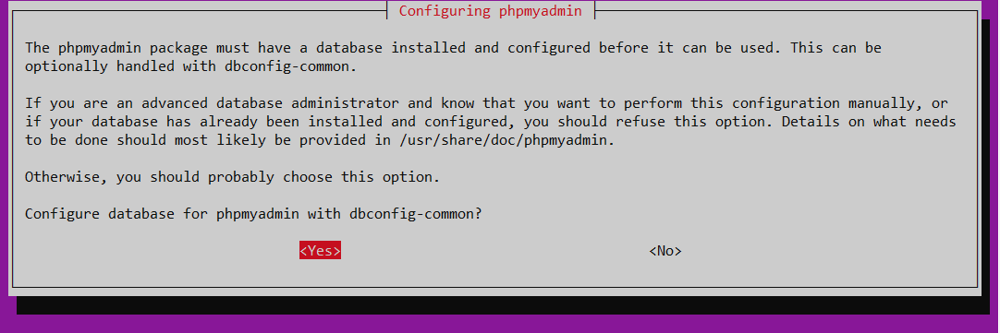

Seleccionamos Unix Socket y le ponemos nombre a la base de datos
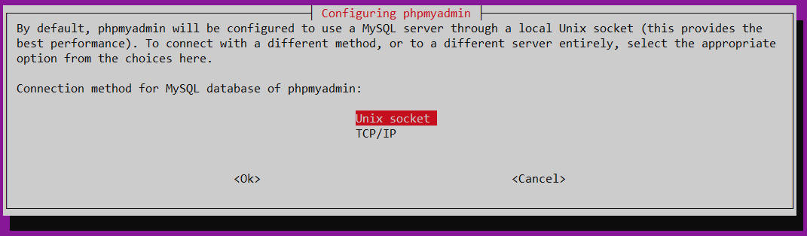
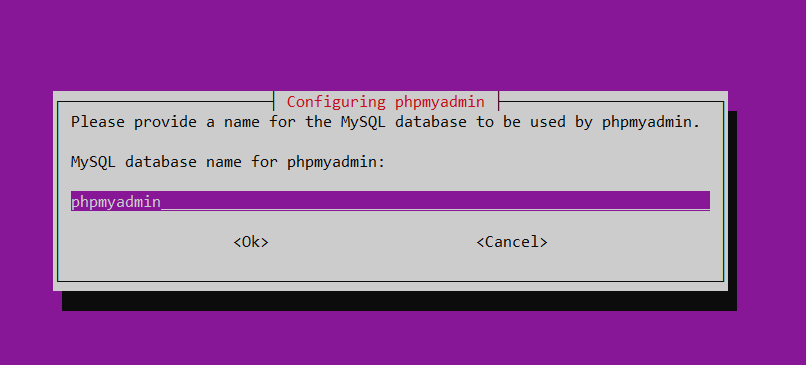

ponemos el usuario para MySQL yo pondre "root@localhost" y la contraseña.
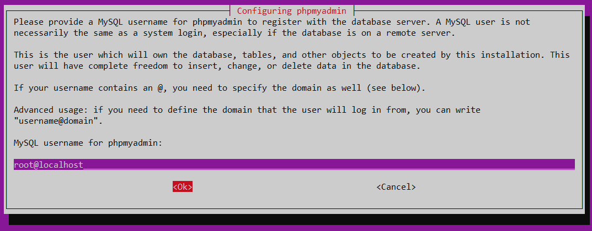
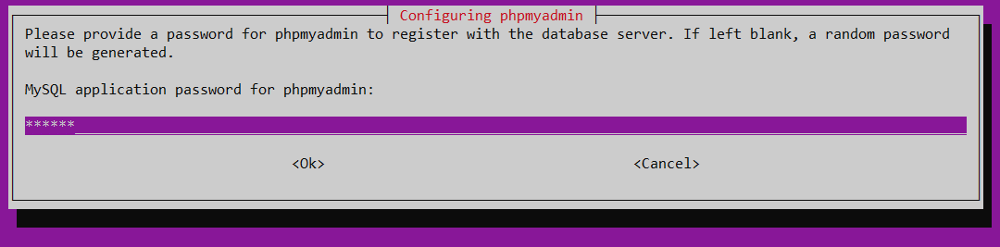

