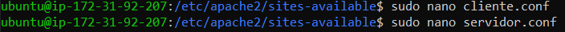

# 1. Virtual Hosts

### 1.1 Añadir subdominios

Vamos a crear dos subdominios (cliente y servidor), para ello vamos a Registros DNS y pondremos dirrecionando a nuesta ip Elástica.

### 1.2 tipos de DNS

 **Tipo A:** es para IP-s(0.0.0.0 por ejemplo). 
**Tipo CNAME:** es para direcciones URL(www.google.es por ejemplo).
**Tipo AAAA:** es para IP-s IPv6.
**Tipo TXT:** son un tipo de registros de sistema de nombres de dominio (DNS) que contienen información de texto de fuentes externas a tu dominio y que puedes añadir a su configuración.

Nosotros pondremos estos nombres a los subdominios(en mi caso "cliente-xarles" y "servidor-xarles") del tipo A y ponemos la IP Estatica que tenemos en AWS IP Estatica.

### 1.3 Creación de carpetas
vamos a crear dos carpetas "cliente y servidor" y dentro de ellas crearemos un archivo index.html con cada uno diciendo si es cliente o servidor.

**También les cambiaramos los permisos a la carpeta "www"**

### 1.4 archivos de configuración
vamos al directorio **"/etc/apache2/sites-avaliable"** y copiamos el archivo **000-default.conf** y copiamos dos veces con los nombres **cliente.conf** y **servidor conf**

Despues de hacer esto vamos a editar y dentro de los archivos pondremos en **ServerName** la direccion del subdominio y en **DocumentRoot** la ruta del archivo donde creamos los index.html

Ahora que hemos creado nuestros archivos de virtual host, debemos habilitarlos. Apache incluye algunas herramientas que nos permiten hacer esto.

Podemos usar la herramienta a2ensite para habilitar cada uno de nuestros sitios así:

Posteriormente, deshabilite el sitio poder defecto definido en 000-default.conf:

Cuando concluyas, deberá reiniciar Apache para hacer que estos cambios sean efectivos:

Ya tienes todo configurado. :smile:

