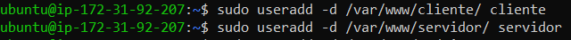
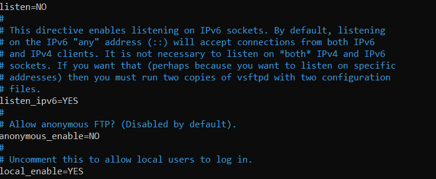

# 1. Servidor ftp
### 1.1 Instalar Vsftpd (Very Secure FTP Daemon)

Es un servicio FTP que permite implementar servicios de archivos mediante protocolo FTP

### 1.2 COMO AÑADIR USUARIOS

para crear usuarios se utilizara este comando:
**sudo useradd -d xxdondexx xxusuarioxx**

 
hay que ponerle contraseña a los usuarios, utiliza este comando:
**sudo passwd nomreDeUsuario**

hay que abrir el puerto 21 para el FTP en el servidor. 

Falta reiniciar el servicio y ya funcionaria, para ello pon este comando:
**sudo service vsftpd restart**

Ya tienes todo configurado. :smile:
