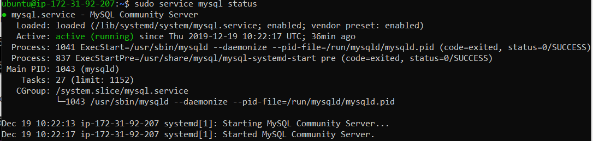

# 1. Crear copias de seguridad mediante comandos

Los comandos que se suelen utilizar para comprimir son estas:Archivos .tar.gz:
Comprimir: **tar -czvf empaquetado.tar.gz /carpeta/a/empaquetar/**
Descomprimir: **tar -xzvf archivo.tar.gz**

Archivos .tar:
Empaquetar: **tar -cvf paquete.tar /dir/a/comprimir/**
Desempaquetar: **tar -xvf paquete.tar**

Archivos .gz:
Comprimir: **gzip -9 index.php**
Descomprimir: **gzip -d index.php.gz**

Archivos .zip:
Comprimir: **zip archivo.zip carpeta**
Descomprimir: **unzip archivo.zip**

Cromprimiremos las carpetas de cliente y servidor.
**tar -cvzf cliente.tgz /var/www/cliente/**

Comprobamos que se han creado correctamente los archivos:

Ahora vamos a ver el estado de MySQL con este comando:
**sudo service mysql status**

creamos una BD:

e exportamos la BD

Ya tienes todo hecho. :smile:
