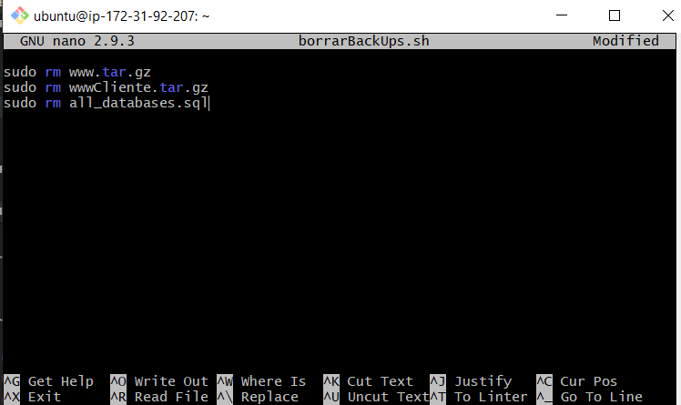

# 1. Automatizar copias de seguridad
## 1.1 CREAR LOS SCRIPT PARA CLIENTE Y SERVIDOR
Crearemos ficheros de comandos .sh o .php para crear ficheros backup.

Primero procederemos a crear el backup del servidor, para ello, crearemos el script.

una vez creado, le cambiaremos los permisos para que solo el root pueda ejecutarlo.

Ahora probaremos que funciona correctamente el script.

Hacemos el mismo paso con el cliente, y comprobamos que funciona.

## 1.2 AUTOMATIZAR BACKUPS
Usando crontab automatizaremos la ejecución de los scripts.
Para ello, nos vamos a **etc** y abrimos **crontab**.

yo voy a configurar para que cada 01:00 haga un backup del servidor y cliente.

si quieres ver un generador de crontab lo tienes aquí: https://www.freeformatter.com/cron-expression-generator-quartz.html

## 1.3 AUTOMATIZAR BORRADO DE BACKUPS

Al automatizar las backups estamos ocupando cada vez mas espacio entonces también deberíamos eliminar algunos backups.

para ello deberemos de hacer otro script.(yo voy a eliminar todos los backup que haya creado y que tenga 7 días)

Probamos que funciona.

una vez hecho esto deberíamos otra vez programar el crontab para que borre automaticamente los backups.
también pondre que haga el borrado a la **1 y 7 minutos cada día**.

Ya tienes todo configurado, ya sabemos automatizar backups y también eliminarlos. :smile:
 